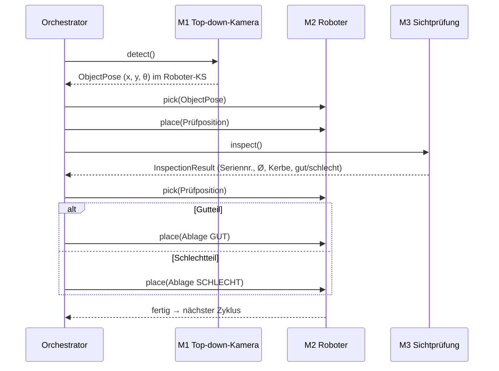

# 00 – Projektübersicht

## Aufgabe

Ein Industrieroboter (Neura Robotics) soll ein Bauteil, das an beliebiger Position und Orientierung in einem Arbeitsbereich liegt, **dynamisch greifen**, einer **automatischen Sichtprüfung** zuführen und anschließend je nach Prüfergebnis als **Gutteil** oder **Schlechtteil** ablegen.

## Ziel

- Ein durchgängig lauffähiger Demonstrator: Bauteil einlegen → System erkennt, greift, prüft, sortiert – ohne manuellen Eingriff.
- Modularer Aufbau: Vier Module mit klaren Schnittstellen, die unabhängig entwickelt und getestet werden können.
- Eine praxisorientierte Ausarbeitung (LaTeX, IEEE-Zitierstil) mit Grundlagen, Umsetzung und Evaluation.

## Ablauf

1. **Erkennen (M1):** Die Top-down-Kamera findet den Arbeitsbereich über vier ArUco-Marker (Rückfall: weißer Rahmen), entzerrt das Bild und bestimmt Position und Orientierung des Bauteils.
2. **Greifen (M2):** Der Roboter fährt die Pose an, greift sicher und legt das Bauteil an der definierten Prüfposition ab.
3. **Prüfen (M3):** Eine seitliche Kamera liest die Seriennummer, vermisst einen Lochdurchmesser und prüft, ob eine Kerbe vorhanden ist. Nur wenn alles erfüllt ist → Gutteil.
4. **Sortieren (M2):** Der Roboter holt das Bauteil wieder ab und legt es auf der Gut- bzw. Schlecht-Ablage ab.

## Hardware (Stand: vorläufig, siehe [08_offene_fragen.md](08_offene_fragen.md))

| Komponente | Beschreibung |
|---|---|
| Roboter | Neura Robotics **LARA** (6 Achsen), Software v5.0.8, Python-API NeuraPy, IP 192.168.2.20 (prüfen) |
| Greifer | im Roboter angelegt: **RobotiQ** (Modbus), Montage prüfen |
| Kamera 1 | Top-down über dem Arbeitsbereich (Modell tbd; Testfotos mit Handykamera) |
| Kamera 2 | Seitlich an der Prüfposition (Testbilder 3840×2160), ggf. mit eigener Beleuchtung |
| Kamera 3 (geplant) | Am Roboterhandgelenk, für das KI-Greifen (M4); Konfiguration `wrist_camera` vorbereitet |
| Marker | 4 ArUco-Marker (`DICT_4X4_50`, 3D-gedruckte Blöcke) an den Ecken eines weißen Rahmens |
| Bauteil | lila 3D-Druck-Quader mit abgeschrägter Ecke (Draufsicht), seitlich: Etikett mit 5-stelliger Seriennummer, Durchgangsloch, kleine eckige Öffnung (= **Kerbe**) |
| Ablagen | Prüfposition, Ablage GUT, Ablage SCHLECHT (feste Posen) |
| Rechner | Windows-Laptop mit Python 3.11 (getestet), LAN-Verbindung zur Robotersteuerung |

## Rollen

| Modul | Verantwortlich | Aufgabe |
|---|---|---|
| M1 – Objekterkennung | Person 1 | Arbeitsbereich + Objektpose aus Top-down-Kamera |
| M2 – Robotersteuerung | Person 2 | Greifen, Ablegen, Sortieren mit dem Neura-Roboter |
| M3 – Sichtprüfung | Person 3 | Seriennummer, Lochdurchmesser, Kerbe → gut/schlecht |
| M4 – KI-Greifen | Person 4 | Alternativer, lernbasierter Greifansatz |
| Integration / Orchestrator | gemeinsam (initial: Niklas) | Ablaufsteuerung, Schnittstellen, Konfiguration |

## Abgrenzung

- Es wird jeweils **ein** Bauteil im Arbeitsbereich betrachtet (keine Vereinzelung aus Schüttgut).
- Das Bauteil liegt flach auf dem Tisch → Pose ist 2D (x, y, θ), Greifhöhe ist bekannt.
- Keine sicherheitszertifizierte Anlage; Betrieb nur unter Aufsicht mit reduzierter Geschwindigkeit.
- M4 wird eigenständig entwickelt und nutzt dieselbe Schnittstelle wie M1, ist aber nicht Voraussetzung für den Demonstrator.
