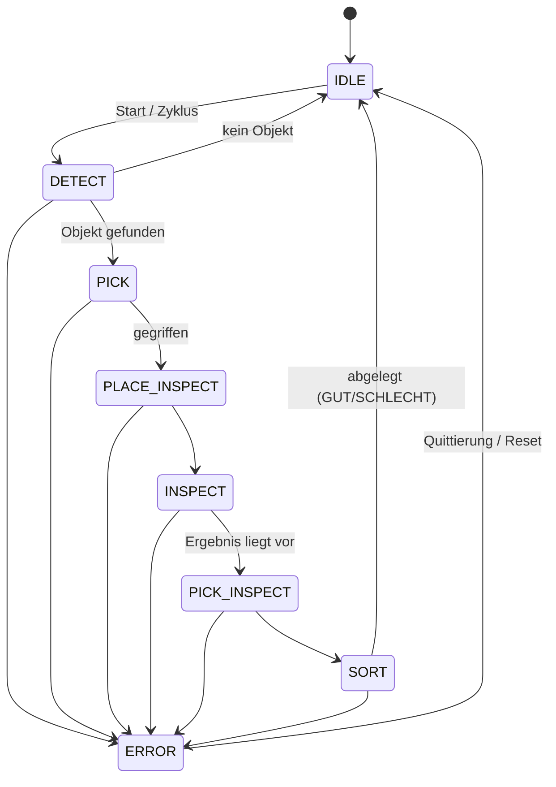

# 01 – Architektur

## Überblick

Ein zentraler **Python-Orchestrator** steuert den Ablauf über einen Zustandsautomaten und ruft die Module als Python-Pakete auf. Die Module kennen sich gegenseitig nicht – sie tauschen ausschließlich die Datenklassen aus `code/common/interfaces.py` aus.

```
                 ┌──────────────────────────┐
                 │   orchestrator/          │
                 │   Zustandsautomat        │
                 └───┬─────────┬────────┬───┘
       ObjectPose    │         │        │   InspectionResult
          ┌──────────┘         │        └──────────┐
          ▼                    ▼                   ▼
  m1_vision_topdown     m2_robot_control     m3_inspection
  (oder m4_ai_grasping)
          │                    │                   │
          └──────── common/ (interfaces, config, camera, transforms) ─┘

  Bedienung:  gui/ (Tabs je Modul + Ablauf + Einstellungen)  ·  CLI: python -m <modul> / orchestrator
```

Jedes Modul stellt eine **abstrakte Klasse** (Interface) und eine **Mock-Implementierung** bereit. Dadurch

- läuft der Orchestrator von Tag 1 an komplett durch (alles gemockt),
- kann jede Person ihr Modul isoliert entwickeln und die übrigen Module mocken,
- lässt sich M1 per Konfiguration gegen M4 austauschen.

## Zustandsautomat



| Zustand | Aktion | Modul |
|---|---|---|
| `IDLE` | Warten auf Start / nächsten Zyklus | – |
| `DETECT` | Bild aufnehmen, Objektpose bestimmen | M1 / M4 |
| `PICK` | Objekt an erkannter Pose greifen | M2 |
| `PLACE_INSPECT` | An Prüfposition ablegen, auf Anfahrhöhe darüber warten (außerhalb des Kamerabilds) | M2 |
| `INSPECT` | Seriennummer, Loch, Kerbe prüfen | M3 |
| `PICK_INSPECT` | Bauteil von Prüfposition greifen | M2 |
| `SORT` | Auf Ablage GUT oder SCHLECHT legen | M2 |
| `ERROR` | Roboter stoppen, Fehler loggen, auf Reset warten | alle |

## Schnittstellen (`code/common/interfaces.py`)

```python
@dataclass
class ObjectPose:          # M1/M4 -> Orchestrator -> M2
    x_mm: float            # position in robot base frame
    y_mm: float
    z_mm: float            # table height / grasp height
    theta_deg: float       # rotation about z, 0..360 (chamfered corner makes it unique)
    confidence: float      # 0..1
    timestamp: float
    image_path: str | None # debug image

@dataclass
class InspectionResult:    # M3 -> Orchestrator -> M2
    serial_number: str | None
    hole_diameter_mm: float | None
    notch_present: bool | None
    is_good: bool
    reasons: list[str]     # why it failed
    timestamp: float

@dataclass
class RobotTarget:         # Orchestrator -> M2 (named poses from config)
    name: str              # "inspection", "bin_good", "bin_bad", "home"
    x_mm, y_mm, z_mm: float
    rx_deg, ry_deg, rz_deg: float
```

Modul-Interfaces:

| Interface | Methoden |
|---|---|
| `ObjectDetector` (M1, M4) | `detect() -> ObjectPose \| None` |
| `RobotController` (M2) | `connect()`, `home()`, `pick(pose)`, `place(target)`, `stop()` |
| `Inspector` (M3) | `inspect() -> InspectionResult` |

## Koordinatensysteme und Kalibrierung

1. **Bild-KS** (Pixel, u/v) der Top-down-Kamera.
2. **Arbeitsbereich-KS** (mm): Ursprung in der inneren linken unteren Ecke des weißen Rahmens (Kamerasicht), x nach rechts, y nach oben. Die Homographie `H_img→ws` wird aus den vier ArUco-Markern (bekannte Positionen in mm) oder aus den vier Innenecken des Rahmens berechnet.
3. **Roboter-Basis-KS** (mm): Die Transformation `T_ws→robot` (2D: Rotation + Translation, ggf. Höhe) wird einmalig bestimmt, indem der Roboter-TCP die Marker-Mittelpunkte anfährt → Least-Squares-Fit mit Restfehler je Punkt (`robot_check calib`, `common.transforms.fit_workspace_to_robot`). Prüfung danach mit dem Zeigetest (`robot_check point`).

`ObjectPose` wird von M1 **bereits im Roboter-KS** geliefert; die Transformationen liegen in `common/transforms.py` und die Kalibrierwerte in `config/system.yaml`.

## Implementierungen und Testmodi

| Modul | Echt | Mock / Test |
|---|---|---|
| M1 | `TopDownDetector` (Kamera + `TopDownPipeline`) | `MockDetector`; Kamera-`source` als Bild-Glob → Wiedergabe der Testfotos |
| M2 | `NeuraRobot` (NeuraPy) | `MockRobot`; `NeuraRobot` gegen `fake_neura_server` |
| M3 | `CameraInspector` (Kamera + `InspectionPipeline`) | `MockInspector`; Bild-Glob als Kamera |

Die Bildverarbeitung steckt jeweils in einer *Pipeline*-Klasse (Bild rein, Ergebnis raus, ohne
Kamerazugriff) und ist dadurch direkt mit Bilddateien testbar. `common/camera.py` stellt Live-Kamera
(`source: 0`) und Dateiwiedergabe (`source: "pfad/*.jpg"`) mit derselben Schnittstelle bereit.

## Startmöglichkeiten und GUI

Jedes Modul ist einzeln startbar (`python -m m1_vision_topdown`, `python -m m2_robot_control`,
`python -m m3_inspection`), der Gesamtablauf mit `python -m orchestrator`. CLI und GUI bauen die
Module über dieselbe Factory (`orchestrator/factory.py`) zusammen:

| Modul | Varianten |
|---|---|
| Erkennung | `mock`, `replay` (Testfotos), `camera`, `ai` (M4) |
| Roboter | `mock`, `sim` (NeuraRobot gegen Simulator), `real` |
| Prüfung | `mock`, `replay` (Testfotos), `camera` |

Die GUI (`python -m gui`, PySide6) hat einen Tab pro Modul, einen Tab für den automatischen Ablauf
und einen Einstellungs-Tab. Eine gemeinsame `Session` hält Konfiguration, Kameras und
Roboterverbindung, damit Einzeltests und Ablauf dieselbe Hardware nutzen, ohne sie doppelt zu
öffnen. Roboterbefehle laufen strikt nacheinander in einem eigenen Thread. Der STOPP-Knopf hat
einen separaten Thread und wird deshalb nie von einer laufenden Bewegung blockiert. Der Orchestrator
meldet jeden Zustandswechsel an Beobachter (`Orchestrator.listeners`), das nutzt die GUI für die
Live-Anzeige. Jeder Zyklus wird als Zeile in `logs/cycles_<datum>.csv` protokolliert
(`orchestrator/logbook.py`), optional mit Debug-Bildern – die Datengrundlage für die Evaluation.

## Konfiguration

Alle hardware- und aufbauspezifischen Werte in `code/config/system.yaml`:

- Kamera-IDs / Auflösungen, Kalibrierdateien
- ArUco-Dictionary, Marker-IDs und deren Positionen im Arbeitsbereich
- Transformation Arbeitsbereich → Roboter
- Benannte Roboterposen (Home, Prüfposition, Ablage GUT/SCHLECHT)
- Prüftoleranzen (Soll-Durchmesser ± Toleranz, Seriennummer-Muster)
- Standard-Varianten für `python -m orchestrator` (`implementations`, siehe Tabelle oben)

Bearbeiten am einfachsten im GUI-Tab *Einstellungen* (Kommentare bleiben beim Speichern erhalten).

## Fehlerbehandlung und Logging

- Jede Modul-Methode wirft bei Fehlern eine eigene Exception (`VisionError`, `RobotError`, `InspectionError`) → Orchestrator wechselt nach `ERROR`.
- Jeder Zyklus bekommt eine ID und landet als Zeile in `code/logs/cycles_<datum>.csv`; optional werden die Debug-Bilder unter `code/logs/<datum>/<uhrzeit>_c<id>/` gespeichert, auf Wunsch zusätzlich alle Zwischenbilder von M1/M3 unter `…/steps/` (`common/trace.py`) (Grundlage für Evaluation und Abbildungen in der Thesis).
- Im Fehlerfall ruft der Orchestrator `robot.stop()` auf; weiter geht es erst nach „Fehler quittieren“ (fährt Home).
